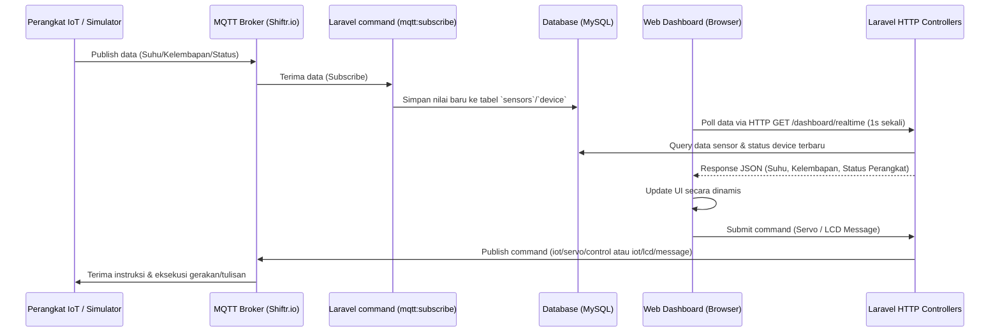

# Product Requirement Document (PRD)
## Dashboard Monitoring IoT & Sensor (Azure Metrics)

Dokumen ini merangkum kebutuhan produk, arsitektur, workflow inti, analisis database, serta panduan optimasi dan pembersihan file untuk proyek **Dashboard-Sensor**.

---

## 1. Workflow Inti (Core Workflows)

Aplikasi ini berfungsi sebagai perantara antara perangkat IoT (hardware) dan pengguna (web dashboard) menggunakan protokol **MQTT** untuk komunikasi data realtime.



### A. Autentikasi & Otorisasi Pengguna (Multi-role)
*   **Fitur:** Register akun baru dan Login.
*   **Role:** 
    *   `admin`: Memiliki akses penuh ke menu **Sensor** (CRUD).
    *   `user`: Memiliki akses ke menu **Device** (CRUD) dan Dashboard.
*   **Middleware:** Menggunakan `RoleMiddleware` untuk membatasi akses berdasarkan role di rute web.

### B. Monitoring Realtime Dashboard
*   Dashboard meminta data realtime ke rute `/dashboard/realtime` menggunakan AJAX `fetch()` setiap **1 detik** (`setInterval`).
*   Data yang diambil meliputi:
    *   Data suhu terakhir (`nama_sensor = 'Suhu'`) dalam batas waktu aktivitas (last seen < 15 detik).
    *   Data kelembapan terakhir (`nama_sensor = 'Kelembapan'`) dalam batas waktu aktivitas.
    *   Daftar perangkat (device) beserta status `online` atau `offline` (dihitung berdasarkan `updated_at` kurang dari 15 detik yang lalu).

### C. Kontrol Perangkat (Publishing MQTT)
*   **Servo Control:** Hanya untuk `admin`. Slider pada dashboard mengirim sudut (0–180 derajat) via POST `/servo/send` yang mempublish pesan ke topik MQTT `iot/servo/control`.
*   **LCD Message:** Form input mengirim tulisan (maks 32 karakter) via POST `/lcd/send` yang mempublish pesan ke topik MQTT `iot/lcd/message`.

### D. Background Worker (Subscribing MQTT)
*   Artisan command `php artisan mqtt:subscribe` berjalan terus-menerus di server background.
*   Command ini berlangganan (subscribe) ke 3 topik:
    1.  `iot/sensor/suhu` -> Menyimpan data angka suhu ke tabel `sensors`.
    2.  `iot/sensor/kelembapan` -> Menyimpan data angka kelembapan ke tabel `sensors`.
    3.  `iot/device/status` -> Menerima JSON data status perangkat, lalu mengupdate status & field `updated_at` di tabel `device`.

---

## 2. Analisis Kolom `type` pada Database & Solusi Penghapusannya

### A. Temuan pada Source Code
1.  **Migrasi Awal:** File `2026_01_21_005402_create_sensors_table.php` mendefinisikan kolom `type` (`$table->string('type');`).
2.  **Migrasi Baru (Penghapusan):** File migrasi `2026_06_07_035038_drop_type_column_from_sensors_table.php` sudah disiapkan untuk menghapus kolom `type` dengan pengecekan aman:
    ```php
    Schema::table('sensors', function (Blueprint $table) {
        if (Schema::hasColumn('sensors', 'type')) {
            $table->dropColumn('type');
        }
    });
    ```
3.  **Model Sensor (`Sensor.php`):** Di dalam properti `$fillable` tertulis `'tipe_sensor'`. Sementara di database, kolom ini **tidak pernah dibuat**, melainkan hanya ada kolom `type` (yang sudah didrop) dan `status`.

### B. Solusi untuk Drop Kolom `type`

Jika database lokal Anda masih memiliki kolom `type` atau jika Anda ingin memastikan kolom tersebut hilang tanpa menyisakan error, gunakan salah satu solusi berikut:

1.  **Menggunakan Artisan Migration (Direkomendasikan)**
    Jalankan perintah migrasi Laravel di terminal:
    ```bash
    php artisan migrate
    ```
    Migrasi `2026_06_07_035038_drop_type_column_from_sensors_table.php` akan otomatis berjalan dan mendrop kolom `type` jika kolom tersebut ditemukan.
    
    Reset data dari awal
    ```bash
    php artisan migrate:fresh --seed
    ```

2.  **Menggunakan Raw SQL Command**
    Jika Anda ingin menghapusnya secara langsung melalui database manager (MySQL/MariaDB client seperti phpMyAdmin, DBeaver, dll):
    ```sql
    ALTER TABLE sensors DROP COLUMN type;
    ```

3.  **Pembersihan di Model `Sensor.php`**
    Ubah isi `$fillable` pada [Sensor.php](file:///c:/Users/PC%20BAZMA%206/Documents/Iqbal-XII/IoT/Dashboard-Sensor%20-%20Copy/app/Models/Sensor.php) untuk menghapus `'tipe_sensor'` karena kolom tersebut tidak ada di schema database.
    ```diff
         protected $fillable = [
             'nama_sensor',
    -        'tipe_sensor',
             'data',
             'status'
         ];
    ```

---

## 3. Daftar File yang Dibutuhkan (Required Files)

Berikut adalah daftar file minimal yang **harus dipertahankan** agar aplikasi web berbasis Blade + MQTT ini berjalan 100% normal:

### A. Backend & Logic (Laravel)
*   **Models:**
    *   [User.php](file:///c:/Users/PC%20BAZMA%206/Documents/Iqbal-XII/IoT/Dashboard-Sensor%20-%20Copy/app/Models/User.php) (Autentikasi & Role)
    *   [Sensor.php](file:///c:/Users/PC%20BAZMA%206/Documents/Iqbal-XII/IoT/Dashboard-Sensor%20-%20Copy/app/Models/Sensor.php) (Menyimpan data suhu/kelembaban)
    *   [Device.php](file:///c:/Users/PC%20BAZMA%206/Documents/Iqbal-XII/IoT/Dashboard-Sensor%20-%20Copy/app/Models/Device.php) (Menyimpan status alat IoT)
*   **Controllers:**
    *   [AuthController.php](file:///c:/Users/PC%20BAZMA%206/Documents/Iqbal-XII/IoT/Dashboard-Sensor%20-%20Copy/app/Http/Controllers/AuthController.php) (Login & Register)
    *   [DashboardController.php](file:///c:/Users/PC%20BAZMA%206/Documents/Iqbal-XII/IoT/Dashboard-Sensor%20-%20Copy/app/Http/Controllers/DashboardController.php) (Logika dashboard utama & API realtime)
    *   [SensorController.php](file:///c:/Users/PC%20BAZMA%206/Documents/Iqbal-XII/IoT/Dashboard-Sensor%20-%20Copy/app/Http/Controllers/SensorController.php) (CRUD Sensor)
    *   [DeviceController.php](file:///c:/Users/PC%20BAZMA%206/Documents/Iqbal-XII/IoT/Dashboard-Sensor%20-%20Copy/app/Http/Controllers/DeviceController.php) (CRUD Device)
    *   [ServoController.php](file:///c:/Users/PC%20BAZMA%206/Documents/Iqbal-XII/IoT/Dashboard-Sensor%20-%20Copy/app/Http/Controllers/ServoController.php) (Pengiriman perintah Servo)
    *   [LCDController.php](file:///c:/Users/PC%20BAZMA%206/Documents/Iqbal-XII/IoT/Dashboard-Sensor%20-%20Copy/app/Http/Controllers/LCDController.php) (Pengiriman teks LCD)
*   **Services:**
    *   [MQTTService.php](file:///c:/Users/PC%20BAZMA%206/Documents/Iqbal-XII/IoT/Dashboard-Sensor%20-%20Copy/app/Services/MQTTService.php) (Konektivitas ke Broker MQTT)
*   **Commands:**
    *   [MQTTSubscribe.php](file:///c:/Users/PC%20BAZMA%206/Documents/Iqbal-XII/IoT/Dashboard-Sensor%20-%20Copy/app/Console/Commands/MQTTSubscribe.php) (Background worker daemon)
*   **Middleware:**
    *   [RoleMiddleware.php](file:///c:/Users/PC%20BAZMA%206/Documents/Iqbal-XII/IoT/Dashboard-Sensor%20-%20Copy/app/Http/Middleware/RoleMiddleware.php) (Filter admin vs user)
*   **Routes:**
    *   [web.php](file:///c:/Users/PC%20BAZMA%206/Documents/Iqbal-XII/IoT/Dashboard-Sensor%20-%20Copy/routes/web.php) (Rute halaman utama & aksi form)
    *   [api.php](file:///c:/Users/PC%20BAZMA%206/Documents/Iqbal-XII/IoT/Dashboard-Sensor%20-%20Copy/routes/api.php) (Standar Laravel API)
    *   [console.php](file:///c:/Users/PC%20BAZMA%206/Documents/Iqbal-XII/IoT/Dashboard-Sensor%20-%20Copy/routes/console.php) (Artisan console routing)

### B. Frontend (Blade Templates)
Aplikasi ini menggunakan HTML + Vanilla CSS yang langsung ditanam di dalam Blade file (inline style).
*   **Layouts:**
    *   [app.blade.php](file:///c:/Users/PC%20BAZMA%206/Documents/Iqbal-XII/IoT/Dashboard-Sensor%20-%20Copy/resources/views/layouts/app.blade.php) (Layout utama dengan CSS Design System)
    *   [auth.blade.php](file:///c:/Users/PC%20BAZMA%206/Documents/Iqbal-XII/IoT/Dashboard-Sensor%20-%20Copy/resources/views/layouts/auth.blade.php) (Layout login & register)
*   **Components:**
    *   [sidebar.blade.php](file:///c:/Users/PC%20BAZMA%206/Documents/Iqbal-XII/IoT/Dashboard-Sensor%20-%20Copy/resources/views/components/sidebar.blade.php) (Navigasi samping)
*   **Pages:**
    *   [dashboard.blade.php](file:///c:/Users/PC%20BAZMA%206/Documents/Iqbal-XII/IoT/Dashboard-Sensor%20-%20Copy/resources/views/dashboard.blade.php) (Halaman dashboard utama + JavaScript realtime polling)
    *   [auth/login.blade.php](file:///c:/Users/PC%20BAZMA%206/Documents/Iqbal-XII/IoT/Dashboard-Sensor%20-%20Copy/resources/views/auth/login.blade.php)
    *   [auth/register.blade.php](file:///c:/Users/PC%20BAZMA%206/Documents/Iqbal-XII/IoT/Dashboard-Sensor%20-%20Copy/resources/views/auth/register.blade.php)
    *   **Sensor Folder:** `index.blade.php`, `create.blade.php`, `edit.blade.php` (CRUD Sensor)
    *   **Device Folder:** `index.blade.php`, `create.blade.php`, `edit.blade.php` (CRUD Device)

---

## 4. Daftar File & Folder yang Tidak Terpakai (Dapat Dihapus)

Aplikasi ini awalnya dibuat menggunakan paket starter kit hybrid (Inertia.js + React + Tailwind CSS). Namun, interface yang digunakan saat ini **murni menggunakan Blade views + Vanilla CSS**. Seluruh kompilasi asset Node.js tidak dipanggil sama sekali di template Blade.

Anda bisa menghapus file/folder berikut untuk merampingkan ukuran proyek:

| Path File / Folder | Jenis | Keterangan |
| :--- | :--- | :--- |
| `resources/js/` | **Folder** | Berisi template React/Inertia, components, hooks, ssr, dll. (Sama sekali tidak dipanggil di Blade). |
| `resources/css/app.css` | **File** | File Tailwind v4 stylesheet yang tidak di-load di layout Blade. |
| `node_modules/` | **Folder** | Dependensi npm untuk kompilasi Javascript React/Tailwind. |
| `package.json` & `package-lock.json` | **File** | Konfigurasi node & daftar dependensi Javascript. |
| `vite.config.ts` | **File** | Konfigurasi bundler Vite untuk React/TypeScript. |
| `tsconfig.json` | **File** | Konfigurasi TypeScript untuk Inertia. |
| `components.json` | **File** | Konfigurasi Shadcn CLI untuk React. |
| `eslint.config.js` | **File** | Linter Javascript/TypeScript. |
| `routes/settings.php` | **File** | Berisi rute pengaturan profil berbasis Inertia yang tidak terhubung dengan sidebar Blade. |
| `app/Http/Controllers/Settings/` | **Folder** | Berisi controller Inertia (`ProfileController.php`, `PasswordController.php`, dll). |
| `app/Http/Requests/Settings/` | **Folder** | Form Requests validasi untuk controller setting Inertia. |
| `app/Http/Middleware/HandleInertiaRequests.php` | **File** | Middleware pengiriman data dari Laravel ke Inertia React. |
| `app/Http/Middleware/HandleAppearance.php` | **File** | Middleware pengaturan tema bawaan kit. |
| `app/Http/Controllers/NewController.php` | **File** | Controller kosong/boiler-plate. |

### ⚠️ PENTING: Langkah Sebelum Menghapus File Rute/Middleware
Jika Anda menghapus `routes/settings.php`, Anda harus menghapus pemanggilannya di [bootstrap/app.php](file:///c:/Users/PC%20BAZMA%206/Documents/Iqbal-XII/IoT/Dashboard-Sensor%20-%20Copy/bootstrap/app.php) agar aplikasi Laravel tidak crash saat booting:

```diff
     ->withRouting(
         web: __DIR__.'/../routes/web.php',
         api: __DIR__.'/../routes/api.php',
         commands: __DIR__.'/../routes/console.php',
         health: '/up',
-        then: function (): void {
-            Route::middleware('web')->group(base_path('routes/settings.php'));
-        },
     )
```

---

## 5. Cara Optimasi Aplikasi (Optimization Strategies)

Saat ini aplikasi sudah bekerja, namun jika data bertambah besar atau ingin performa lebih optimal, lakukan strategi berikut:

### 1. Migrasi dari HTTP Polling ke WebSockets (Realtime Optimization)
*   **Masalah:** Saat ini dashboard memanggil API `/dashboard/realtime` setiap 1 detik. Jika ada 100 user membuka dashboard bersamaan, server akan menerima **100 request/detik** yang membebani CPU dan Database.
*   **Solusi:** Gunakan **Laravel Reverb** (WebSockets bawaan Laravel 11) atau **Pusher**. 
    *   Ubah command `mqtt:subscribe` agar saat menerima data baru, ia melakukan *broadcast* event: `broadcast(new SensorUpdated($data))`.
    *   Halaman frontend dashboard cukup mendengarkan channel WebSocket menggunakan Laravel Echo alih-alih `setInterval`.

### 2. Tambahkan Database Indexing
*   Untuk mempercepat pencarian data terbaru pada query real-time:
    *   Tabel `sensors`: Tambahkan index pada kolom `nama_sensor` dan `created_at`.
    *   Tabel `device`: Tambahkan index pada kolom `serial_number`.
*   *Caranya:* Buat migrasi baru untuk menambahkan index pada tabel-tabel tersebut.

### 3. Menggunakan Queue Worker untuk MQTT Subscriber
*   Menjalankan `php artisan mqtt:subscribe` secara manual rentan berhenti jika terjadi error/timeout.
*   **Solusi:** Gunakan **Supervisord** di server produksi untuk memantau proses `php artisan mqtt:subscribe` agar otomatis berjalan kembali jika crash (auto-restart).
*   Alternatif lainnya adalah mengintegrasikan client MQTT dengan Queue Job Laravel (Redis/Database Driver) agar pengolahan data sensor tidak menghambat thread utama subscriber.

### 4. Database Clean-up / Partitioning
*   Data sensor IoT terkumpul sangat cepat (ribuan baris per hari).
*   **Solusi:** Buat sebuah command cron job (Schedule) mingguan/bulanan untuk menghapus data lama (misal data sensor > 30 hari yang lalu) atau memindahkannya ke tabel arsip agregat agar tabel utama tetap berukuran kecil dan cepat saat di-query.
